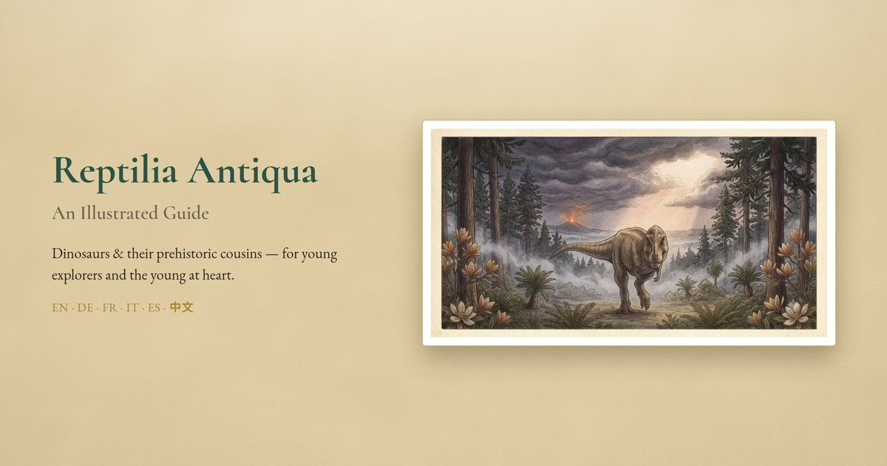

# Reptilia Antiqua

**An illustrated guide to dinosaurs & their prehistoric cousins** — for young explorers and the young at heart.

Tap any creature on the timeline to learn fun facts, see how big it was, and hear how to say its name. The interface is fully localised in **English, Deutsch, and Français**, with **Italiano, Español, and 中文 (繁體)** adding each creature's name and pronunciation. Next time your toddler shouts "Spinosaurus!", you'll be ready.

A single `index.html` styled like a vintage natural-history monograph, with original AI-generated watercolour plates and pre-recorded pronunciations for every creature.

## View it

- **Online:** **https://yingzhiva.github.io/Reptilia-Antiqua/** (hosted on GitHub Pages).
- **Locally:** just open `index.html` in any modern browser — no build step, no dependencies.

> Each creature's name is read aloud by a pre-recorded neural voice (British English for the English names); if a clip can't load, your device's built-in voice fills in.

## Features

- Non-uniform geological timeline (busy eras stretched, long empty stretches folded away)
- Survivors of the extinction shown *past* the asteroid line — because birds are living dinosaurs
- Six languages: full interface localisation in **English, Deutsch & Français**; **Italiano, Español & 中文 (繁體)** add each name + pronunciation
- A "field-guide" card per creature — name & group (Dinosaur / Pterosaur / …), period, a size-vs-human bar, fun facts, and recorded pronunciation (selected language + English)
- Browse cards without leaving: prev/next arrows, swipe, or arrow keys

## Feedback

Spotted an error or have an idea? Please [open an issue](https://github.com/YingzhiVA/Reptilia-Antiqua/issues) — corrections and suggestions are very welcome.

## Artwork

The full-size illustrations live in [`art/`](art/) — one image per creature, with friendly filenames (e.g. `art/brachiosaurus.png`). They were generated with Google Gemini ("Nano Banana") and are dedicated to the **public domain under [CC0 1.0](art/LICENSE)** — grab and reuse them however you like (personal, educational, or commercial), no permission or attribution required. A link back is always appreciated. 🦕

## Pronunciation audio

Clips live in [`audio/`](audio/) — one short MP3 per name per language — pre-generated with Google Cloud Text-to-Speech. Regenerate or extend them with [`tools/gen_audio.py`](tools/gen_audio.py) (needs your own key in `GOOGLE_TTS_KEY`; never committed).

## Credits & licence

- **Illustrations (`art/`):** generated with Google Gemini ("Nano Banana"); released under [CC0 1.0 — public domain](art/LICENSE).
- **Pronunciation audio (`audio/`):** generated with Google Cloud Text-to-Speech; © Google.
- **Code & text:** © 2026 [YingzhiVA](https://github.com/YingzhiVA), released under the [MIT License](LICENSE).
- **Built with:** [Claude](https://www.anthropic.com/claude) (Anthropic) — pair-programmed the app, design, and tooling.
